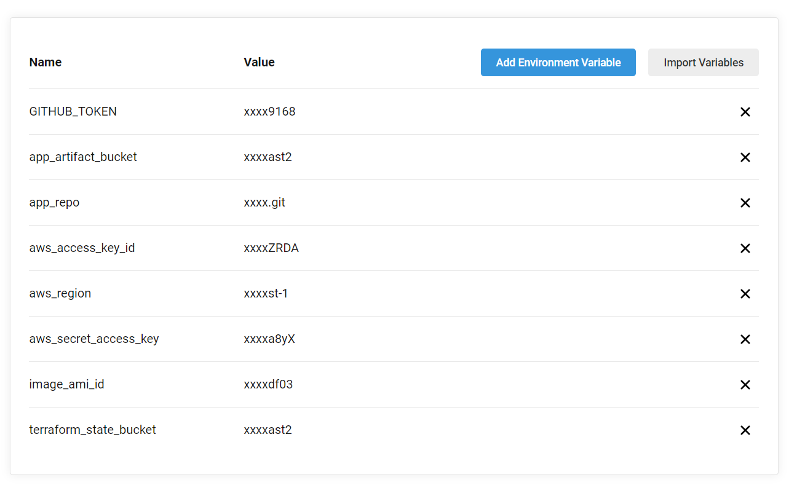

# TechChallengeApp on AWS EC2 Instance

This step-by-step tutorial explains how to deploy Servian TechChallenge App using Circle CI **on AWS EC2 Instances**.

**I have tested this setup on AWS region `us-east-1` and also the terraform variable.tf file has values set as per the region `us-east-1` so i recommend to use the same region. If you want to test and deploy the resources in any other region then it requires changes mentioned here ➡ [**b**](#b)**.

- [Table of Contents](#table-of-contents)
  - [**CircleCI Pipeline**](#circleci-pipeline)
    - [**Prerequisites**](#prerequisites)
      - [Add environment variable in the circleci project](#add-environment-variable-in-the-circleci-project)
    - [**CircleCI Pipeline Stages**](#circleci-pipeline-stages)
      - [terraform_backend](#terraform_backend)
      - [build](#build)
      - [terraform_deploy](#terraform_deploy)
      - [app_status](#app_status)
      - [release](#release)

  - [**TechChallengeAPP Three Tier Architecture on AWS**](#techChallengeAPP-three-tier-architecture-on-AWS)

    Let’s go through each of the tiers:
    - [**Tier 1: Public access - Application Load balancer**](#tier-1-public-access---application-load-balancer)
    - [**Tier 2: Restricted access - Multiple App servers in private subnet**](#tier-2-restricted-access---multiple-app-servers-in-private-subnet)
    - [**Tier 3: Restricted access - Database Running in private Subnet**](#tier-3-restricted-access---database-running-in-private-subnet)

  - **[Detail description of the Terraform code in the Three-Tier AWS architecture](#Detail-description-of-the-Terraform-code-in-the-Three-Tier-AWS-architecture)**
    - **[Prerequisites for setting up AWS Infrastructure using terraform](#prerequisites-for-setting-up-aws-infrastructure-using-terraform)**
    - **[Terraform Variables](#terraform-variables)**
    - **[Terraform State file](#terraform-state-file)**
    - **[Create a Provider for AWS](#create-a-provider-for-aws)**
    - **[Create a VPC and Internet Gateway](#create-a-vpc-and-internet-gateway)**
    - **[Create a Public Subnet, Internet Gateway and Security Group](#create-a-public-subnet,-internet-gateway-and-security-group)**
    - **[Create a Private Subnet, Nat Gateway, Security Group for Application](#Create-a-private-subnet,-nat-gateway,-security-group-for-application)**
    - **[Create a Private Subnet, Security Group for RDS and launch it in multi AZ](#create-a-private-subnet-security-group-for-rds-and-launch-it-in-multi-az)**
    - **[Create IAM role and policies](#create-iam-role-and-policies)**
    - **[Userdata script](#userdata-script)**
    - **[Create and store encrypted secrets in SSM parameter store](#create-and-store-encrypted-secrets-in-ssm-parameter-store)**
    - **[Launch Application servers using AWS launch config and auto scaling group](#launch-application-servers-using-aws-launch-config-and-auto-scaling-group)**
    - **[Create Cloudwatch Alarm and Autoscaling group policies](#create-cloudwatch-alarm-and-autoscaling-group-policies)**
    - **[Create application load balancer, Listener and Target group](#create-application-load-balancer,-listener-and-target-group)**
  
  - **[Access Servian App and Tag the Release](#access-servian-app-and-tag-the-release)**
  - **[Blue Green Deployment](#blue-green-deployment)**

## **CircleCI Pipeline**

This section explains the prerequisite of setting up ci/cd pipeline using circleci for TechchallengeApp running on AWS EC2 Instance.

## **Prerequisites**

- First, create the blank repo on your github account
- Secondly, clone/copy the repo <> on the above newly created blank repo.
- Third, create free circleci account, integrate it with your github account to give permission/allow the access onto the newly created github repo. Once the github account integrated with circleci, and has required permission click on set up project button as mentioned in following diagram so that build can be trigger from circleci. There are two option you will see after github authorized to/integrate with circle CI as highlighted below, one is the setup project this one we need to select to add github repo to circleci while other (`Unfollow Project`) shows already integrated project in circleci.

- After circleci project ready, go to the project and click on project setting option on the top right side and choose environment variables option to set all **seven environmental variables** in the project mentioned in the below diagram.
- Create AWS free tier account.
- Terraform version 0.12.0, you don't need to download it, it will be automatically get downloaded during the circleci different stages.

**Note:**

**a**)

I have found that when we add new github project in circleci, it ask for **Commit and Run** on the newly added github project. Because we have not set all the environmental variable yet for the project so i recommend here that trigger the build by choosing (`Commit and run`) then cancel it at the same time then go to the project again to set all the environmental variables mentioned in the below section.
  
#### b)

 One more important thing, if you want to deploy resources in any other AWS region than **us-east-1** then change these four values (`aws_region, az_zone_1, az_zone_2, image_id`) in `variables.tf` located under the folder `servian/app/deploy`.

### **Add environment variable in the CircleCI project**


I have added the below variables using Circleci WebUI due to security reasons because some variables contains secret values such as aws access key & access key id, github token which we don't want to show in github repo.

- **GITHUB_TOKEN**: Configure the github token by choosing the option personal access tokens from the github setting -> then developer setting -> Personal access tokens. This token will be used to create the release in the repo.

- **app_artifact_bucket**: Choose the unique name of S3 bucket otherwise build stage will fail so make sure this bucket name do not exist before. This bucket will be used to store the build stage artifact.

- **app_repo**: Set this variable value as (TechCallengeApp repo link)  <https://github.com/servian/TechChallengeApp.git>. It will be used in the ec2 userdata script, build and release stage.

- **aws_access_key_id**: Set the AWS access key
  
- **aws_secret_access_key**: Set the AWS secret key
  
- [**aws_region**](#aws-_-region): Set the AWS region (for example us-east-1) where you want to deploy the app, other AWS resources.

- **terraform_state_bucket**: Again choose the unique S3 bucket name. This bucket will be used to store the terraform state file.
- **image_ami_id**: AMI image id of ec2 instance as per the AWS region for us-east-1 set it as **ami-042e8287309f5df03**  this is the current defaul value set in `variables.tf` file.

After github repo integrated with circleci and environmental variable configured. Now its time to trigger the pipeline, to start the pipeline click on the rerun workflow from start option on the right side of the pipeline as highlighted in this diagram.


Once the pipeline starts it goes through five different stages (**terraform_backend, build, terraform_deploy, app_status, release** detail about each stage explained in below section) and will take initially the time between 20-30 min depend upon how much time multi-az RDS instance takes to reach in available state.

Successful pipeline will look something like this:


#### **CircleCI Pipeline Stages**

- #### **terraform_backend**

     In the first stage of pipeline, it create two S3 bucket as per the environmental variable `app_artifact_bucket` and `terraform_state_bucket`.

- #### **build**

   In the second/build stage ((**build stage**), it downloads the code from the repo <https://github.com/servian/TechChallengeApp.git> then build the code and tag the artifact as per the version defined in cmd/root.go file and finally upload it in the S3 bucket.

- #### **terraform_deploy**

   In the third stage, which is AWS infrastructure deployment stage. It makes the change in the ec2 userdata script, and in other terraform files as per the environment variable and finally it creates the three tier infrastructure on AWS. Detail about each infrastructure component is mentioned in this section [**TechChallengeAPP three tier architecture on AWS**](#techChallengeAPP-three-tier-architecture-on-AWS).

- #### **app_status**

   In the fourth stage of the pipeline, it perform healthcheck checks on the application load balancer (ALB DNS NAME) endpoint (/healthcheck/) and expect the  OK response. In case of health check failure/unhealthy response, the pipeline will fail and will not proceed to the release stage. To get the endpoint detail we are using terraform show command as mentioned in the script `status.sh` exist under the folder `statebucket`.

- #### **release**

    As mentioned above only after the fourth stage is successful, the last and the fifth stage will be executed. This stage creates a release, pre-release based on the version mentioned in the root.go file.

## **TechChallengeAPP Three Tier Architecture on AWS**

  I have used terraform to create the below mentioned three tier infrastructure on AWS.


### **Tier 1: Public access - Application Load balancer**

Tier1 is publicly accessible and it has two subnets(ip address range 10.0.5.0/24 & 10.0.6.0/24) spread across two availability zone (us-east-1a, us-east-1b). Application load balancer (ALB) gets deployed in a public subnet so that end user can access application from internet. To achieve high availability for the application two NAT gateway will also be get deployed in each of these public subnets. Application load balancer listens on a port 80 and forwards the traffic to the backend instances running in tier2 at port 3000. Application load balancer target group configured to perform a health check of backend at port 3000 on the path /healthcheck/.

### **Tier 2: Restricted access - Multiple App servers in private subnet**

Tier2 also consists of two private subnets (IP address range 10.0.3.0/24 & 10.0.4.0/24) with a NAT gateway attached to the routes associated with these subnets so that instances running in the private subnet can reach the internet. Application instances running in the private subnets are managed/launched under the autoscaling group. Cloudwatch monitoring enabled and configured for scale Out & scale In of the instance based on CPU metrics. These instances registered themselves under the target group which is attached to the ALB. Application security group ingress rule on the private subnet only allows traffic from the load balancer security group at port 3000.

### **Tier 3: Restricted access - Database Running in private Subnet**
  
Tier3 is the last tier in the architecture, in this tier database instances reside and running in a multi-AZ environment. This tier also spread across two availability zone, the master is running in one zone while the standby is running on another zone which will take over in case of primary DB fails. Private subnet range for this tier is 10.0.1.0/24 & 10.0.2.0/24. DB Security group ingress rule only allows traffic from the application security group at port 5432.

# **Detail description of the Terraform code in the Three-Tier AWS architecture**

### **Prerequisites for setting up AWS Infrastructure using Terraform**

- Already mentioned in the above section [**prerequisites**](#prerequisites).

### **Terraform Variables**

Terraform variable file located under the folder app/deploy/variables.tf and following is detailed description of each variable. Most of the variables are self explanatory.

- `aws_region`: AWS region
- `image_id`:  AMI Image ID
- `instance-type`: AWS instance Type
- `aws_network_cidr`: VPC network CIDR range
- `aws_pub_subnet_1_cidr`: Tier1/Public tier subnet1 range
- `aws_pub_subnet_2_cidr`: Tier1/Public tier subnet2 range  
- `aws_app_subnet_1_cidr`: Tier2/App tier subnet1 range
- `aws_app_subnet_2_cidr`: Tier2/App tier subnet2 range  
- `aws_db_subnet_1_cidr`:  Tier3/DB tier subnet1 range
- `aws_db_subnet_2_cidr`:  Tier3/DB tier subnet2 range
- `az_zone_1`: Availability zone1
- `az_zone_2`: Availability zone2
- `db_user`: Database user
- `db_class`: Database instance/class type
- `db_name`: Database name to create
- `db_engine`: Database engine type (example, mysql, postgresql etc..)
- `db_engine_version`: Database version number
- `db_identifier`: Unique database name
- `storage_encrypted`: Storage encryption option true or false
- `maintenance_window`: Database maintenance window time period
- `backup_window`: Database backup window
- `enabled_cloudwatch_logs_exports`: Enable cloudwatch logging for database
- `backup_retention_period`: Backup retention duration, we can set between 0 to 35
- `skip_final_snapshot`: This option is to skip the final snapshot when database deleted default is false.
- `deletion_protection`: Deletion protection, for production set it to true
- `multi_az`: RDS instance deployed with multi-AZ option provide high availability

### **Terraform State File**

Terraform state file will be stored in the S3 bucket (`as per the circleci project environment variable -> terraform_state_bucket`) which will be created during the first stage (`terraform_backend`) of the pipeline. This state file will be used in later stage (`app_status`) to check the ALB dns name to perform healtheck of the endpoint (/healthcheck/) also it is good practice to store state file outside local environment such as S3, dynamodb, consul etc.

```sh
# Terraform S3 backend to store state file
terraform {
  backend "s3" {
    bucket = "app-terraform-state-bucket"
    key    = "terraform.tfstate"
    region = "aws-region"
  }
}
```

### **Create a provider for AWS**

Provider file (`provider.tf`) exist under the path on the repo servian/app/deploy. AWS region value will be updated as per the value set in variable.tf.

```sh
provider "aws" {
  region = var.aws_region
}
```

### **Create a VPC and Internet Gateway**

To build the whole infrastructure for the application, first, we need to create the VPC. Here we will create a VPC with the CIDR range of 10.0.0.0/16. Then create the internet gateway which provides connectivity to the internet and attached it to the vpc. Set the DNS option as default to `AmazonProvidedDNS` which is provided AWS but it can be configured to custom DNS value as well and finally associate it to vpc.


**`aws_vpc.app_vpc`**: This resouces will create vpc and we just configured the CIDR range and enabled dns.
**`aws_internet_gateway.app_igw`:** Defines an internet gateway to be used by the public subnet and the NAT for the private subnets.
**`aws_vpc_dhcp_options.dns_resolver and aws_vpc_dhcp_options_association.dns_resolver`:** Defines the DNS server for our VPC. We will use the amazon provided DNS for simplicity but you can add any other DNS ip here. Finally we associate the DNS configuration with our app_vpc resource.

```sh
# VPC
resource "aws_vpc" "app_vpc" {
  cidr_block           = var.aws_network_cidr
  enable_dns_support   = true
  enable_dns_hostnames = true
  tags = {
    Name = "Servian App VPC"
  }
}

# Internet Gateway
resource "aws_internet_gateway" "app_igw" {
  vpc_id = aws_vpc.app_vpc.id
  tags = {
    Name = "Servian APP VPC Internet Gateway"
  }
}

# dhcp options
resource "aws_vpc_dhcp_options" "dns_resolver" {
  domain_name_servers = ["AmazonProvidedDNS"]
}

# Associate dhcp with vpc
resource "aws_vpc_dhcp_options_association" "dns_resolver" {
  vpc_id          = aws_vpc.app_vpc.id
  dhcp_options_id = aws_vpc_dhcp_options.dns_resolver.id
}
```

### **Create a Public Subnet, Internet Gateway and Security Group**

In the VPC, Tier1 has two public subnets (`pub_subnet_1 (10.0.5.0/24), pub_subnet_2 (10.0.6.0/24)`) as mentioned in the above AWS architect diagram and both these subnets has access to internet via internet gateway. Let discuss in detail each of these resource and how it is been associated with each other. As the application load balancer will be launched in the public subnet we are using security group to allow traffic at port 80 from outside world.

`aws_subnet.pub_subnet_1`: This resource will create public subnet1 (IP address range 10.0.5.0/24) in availability zone us-east-1a
`aws_subnet.pub_subnet_2`: This resource will create public subnet2 (IP address range 10.0.6.0/24) in availability zone us-east-1b
`aws_route_table.public-routes`: This resource will create public routes which has internet gateway attached to it
`aws_route_table_association.public-subnet-routes-1`: This resource will associate the above created routing table (public-routes) with the subnet 1
`aws_route_table_association.public-subnet-routes-2`:This resource will associate the above created routing table (public-routes) with the subnet 2
`aws_security_group.lb_asg`: This resource create the security group which allow only traffic at port 80 of the applicaiton load balancer from the internet

```sh
# Public Subnet Groups required by load balancer

resource "aws_subnet" "pub_subnet_1" {

  vpc_id     = aws_vpc.app_vpc.id
  cidr_block = var.aws_pub_subnet_1_cidr
  tags = {
    Name = "Public Subnet 1"
  }
  availability_zone = var.az_zone_1
}

resource "aws_subnet" "pub_subnet_2" {

  vpc_id     = aws_vpc.app_vpc.id
  cidr_block = var.aws_pub_subnet_2_cidr
  tags = {
    Name = "Public Subnet 2"
  }
  availability_zone = var.az_zone_2
}


# Route with internet gateway attached

resource "aws_route_table" "public-routes" {
  vpc_id = aws_vpc.app_vpc.id
  route {
    cidr_block = "0.0.0.0/0"
    gateway_id = aws_internet_gateway.app_igw.id
  }
  tags = {
    Name = "RT Internet Gateway"
  }
}

# Route table association with Public Subnet
resource "aws_route_table_association" "public-subnet-routes-1" {
  subnet_id      = aws_subnet.pub_subnet_1.id
  route_table_id = aws_route_table.public-routes.id
}

resource "aws_route_table_association" "public-subnet-routes-2" {
  subnet_id      = aws_subnet.pub_subnet_2.id
  route_table_id = aws_route_table.public-routes.id
}


#LoadBalancer sg

resource "aws_security_group" "lb_asg" {
  name        = "ALB Security Group"
  description = "Allow HTTP  Traffic from Internet to Load Balancer"
  vpc_id      = aws_vpc.app_vpc.id


  ingress {
    from_port   = 80
    to_port     = 80
    protocol    = "tcp"
    cidr_blocks = ["0.0.0.0/0"]

  }

  egress {
    from_port   = 0
    to_port     = 65535
    protocol    = "tcp"
    cidr_blocks = ["0.0.0.0/0"]
  }

  tags = {
    Name = "ALB SG"
  }

}
```

### **Create a Private Subnet, Nat Gateway, Security Group for Application**

In the Application Tier (Tier2) we are also going to create two private subnets (`app_subnet_1 (10.0.3.0/24), app_subnet_2 (10.0.4.0/24)`) in the two availability zones and both these subnets has NAT Gateway attached to it so that the instances can reach the internet. In order to provide the restricted access to this tier only traffic from the load balancer security group at port 3000 is allowed.

`aws_subnet.app_subnet_1`: This resource will create public subnet1 (IP address range 10.0.3.0/24) in availability zone us-east-1a
`aws_subnet.app_subnet_2`: This resource will create public subnet1 (IP address range 10.0.4.0/24) in availability zone us-east-1b
`aws_eip.nat-eip`: This resources create the Elastic ip address required by NAT Gateway

`aws_eip.nat-eip-2`: This resources create the Elastic ip address required by the second NAT Gateway

`aws_nat_gateway.nat-gw`: This resources created the NAT Gateway

`aws_nat_gateway.nat-gw1`: This resources created the second NAT Gateway

`aws_route_table.app-subnet-routes`: This resource will create the route table which has 1st NAT gateway attached to it

`aws_route_table.app-subnet-routes-2`: This resource will create the second route table which has 2nd NAT gateway attached to it

`aws_route_table_association.app-subnet1-routes`: This resource will associate the route table created in previous step to app_subnet_1

`aws_route_table_association" "app-subnet2-routes`: This resource will associate the route table created in previous step to app_subnet_2

`aws_security_group.app_asg`: This resource will create application security group (APP SG)

`aws_security_group_rule.app_lb_ingress_rule`: This resource will create the ingress rule for app_asg security group to allow traffic only from load balancer security group (lb_asg) at port 3000

```sh
#Provision APP Subnet
resource "aws_subnet" "app_subnet_1" {
  vpc_id     = aws_vpc.app_vpc.id
  cidr_block = var.aws_app_subnet_1_cidr
  tags = {
    Name = "APP subnet 1"
  }
  availability_zone = var.az_zone_1
}


resource "aws_subnet" "app_subnet_2" {
  vpc_id     = aws_vpc.app_vpc.id
  cidr_block = var.aws_app_subnet_2_cidr
  tags = {
    Name = "APP subnet 2"
  }
  availability_zone = var.az_zone_2
}

# NAT Gateway configuration for private subnets
resource "aws_eip" "nat-eip" {
  vpc        = true
  depends_on = ["aws_internet_gateway.app_igw", "aws_vpc_dhcp_options_association.dns_resolver"]
  tags = {
    Name = "Nat Gateway EIP"
  }
}

resource "aws_nat_gateway" "nat-gw" {
  allocation_id = aws_eip.nat-eip.id
  subnet_id     = aws_subnet.pub_subnet_1.id
  depends_on    = ["aws_internet_gateway.app_igw"]
  tags = {
    Name = "Nat Gateway"
  }
}

## EIP1  for NAT Gateway
resource "aws_eip" "nat-eip-2" {
  vpc        = true
  depends_on = ["aws_internet_gateway.app_igw", "aws_vpc_dhcp_options_association.dns_resolver"]
  tags = {
    Name = "Nat Gateway EIP 2"
  }
}

## EIP2   for NAT Gateway
resource "aws_nat_gateway" "nat-gw1" {
  allocation_id = aws_eip.nat-eip-2.id
  subnet_id     = aws_subnet.pub_subnet_2.id
  depends_on    = ["aws_internet_gateway.app_igw"]
  tags = {
    Name = "Nat Gateway 2"
  }
}

# Route Table with NAT gateway
resource "aws_route_table" "app-subnet-routes" {
  vpc_id = aws_vpc.app_vpc.id
  route {
    cidr_block     = "0.0.0.0/0"
    nat_gateway_id = aws_nat_gateway.nat-gw.id
  }

  tags = {
    Name = "RT NAT Gateway 1"
  }
}

resource "aws_route_table" "app-subnet-routes-2" {
  vpc_id = aws_vpc.app_vpc.id
  route {
    cidr_block     = "0.0.0.0/0"
    nat_gateway_id = aws_nat_gateway.nat-gw1.id
  }

  tags = {
    Name = "RT NAT Gateway 2"
  }
}

# Route Table Association with APP subnet

resource "aws_route_table_association" "app-subnet1-routes" {
  subnet_id      = aws_subnet.app_subnet_1.id
  route_table_id = aws_route_table.app-subnet-routes.id
}

resource "aws_route_table_association" "app-subnet2-routes" {
  subnet_id      = aws_subnet.app_subnet_2.id
  route_table_id = aws_route_table.app-subnet-routes-2.id
}

#APP Security Group

resource "aws_security_group" "app_asg" {
  name        = "APP Security Group"
  description = "Allow HTTP from Load Balancer"
  vpc_id      = aws_vpc.app_vpc.id


  egress {
    from_port   = 0 # need to address
    to_port     = 65535
    protocol    = "tcp"
    cidr_blocks = ["0.0.0.0/0"]
  }

  tags = {
    Name = "APP SG"
  }

}

resource "aws_security_group_rule" "app_lb_ingress_rule" {
  type                     = "ingress"
  from_port                = 3000
  to_port                  = 3000
  protocol                 = "tcp"
  security_group_id        = aws_security_group.app_asg.id
  source_security_group_id = aws_security_group.lb_asg.id
}
```

### **Create a Private Subnet, Security Group for RDS and launch it in multi AZ**

In the database Tier (Tier3), again we are going to create two private subnets (In two availability zones ) (`db_subnet_1 (10.0.1.0/24, db_subnet_2 (10.0.2.0/24)`) for RDS database but with no access to internet and can only be accessible from application security group (`APP SG`) at port 5432. Following is the detail of the resources terraform will create as per the below .tf file.

`aws_subnet.db_subnet_1`: This resource will create public subnet1 (IP address range 10.0.1.0/24) in availability zone us-east-1a
`aws_subnet.db_subnet_2`: This resource will create public subnet1 (IP address range 10.0.2.0/24) in availability zone us-east-1b
`aws_db_subnet_group.db_subnet`: This resource will create subnet group is required during the lauch of RDS instance, and RDS instance will be launched in these private subnets. As we are deploying multi AZ RDS instance so in this case primary instance will be in one az while the standy will get deployed in other az .
`aws_security_group.db`: This resource will only allow connectivity from application security group (app_asg) at port 5432

```sh
###### Provision RDS Postgres Database
#### DATABASE SUBNETS
resource "aws_subnet" "db_subnet_1" {
  vpc_id     = aws_vpc.app_vpc.id
  cidr_block = var.aws_db_subnet_1_cidr
  tags = {
    Name = "DB subnet 1"
  }
  availability_zone = var.az_zone_1
}

resource "aws_subnet" "db_subnet_2" {
  vpc_id     = aws_vpc.app_vpc.id
  cidr_block = var.aws_db_subnet_2_cidr
  tags = {
    Name = "DB subnet 2"
  }
  availability_zone = var.az_zone_2
}


# Create DB subnet group
resource "aws_db_subnet_group" "db_subnet" {
  name       = "app_db_subnet_group"
  subnet_ids = [aws_subnet.db_subnet_1.id, aws_subnet.db_subnet_2.id]
  tags = {
    Name = "App DB"
  }
}


# Database instance provisioning

resource "aws_db_instance" "app_db" {
  identifier                      = var.db_identifier
  instance_class                  = var.db_class
  allocated_storage               = 20
  engine                          = var.db_engine
  name                            = var.db_name
  password                        = random_password.password.result
  username                        = var.db_user
  engine_version                  = var.db_engine_version
  db_subnet_group_name            = aws_db_subnet_group.db_subnet.name
  vpc_security_group_ids          = [aws_security_group.db.id]
  storage_encrypted               = var.storage_encrypted
  maintenance_window              = var.maintenance_window
  backup_window                   = var.backup_window
  enabled_cloudwatch_logs_exports = var.enabled_cloudwatch_logs_exports
  backup_retention_period         = var.backup_retention_period
  skip_final_snapshot             = var.skip_final_snapshot
  deletion_protection             = var.deletion_protection
  multi_az                        = var.multi_az

  tags = {
    Name = "APP DB"

  }
}

### SECURITY GROUP
resource "aws_security_group" "db" {
  name   = "Database Security Group"
  vpc_id = aws_vpc.app_vpc.id

  # Egress to everyone
  egress {
    from_port   = 0
    to_port     = 0
    protocol    = "-1"
    cidr_blocks = ["0.0.0.0/0"]
  }
  tags = {
    Name = "DB SG"
  }
}

# Allow connection from APP Security Group
resource "aws_security_group_rule" "db_app_ingress_rule" {
  type                     = "ingress"
  from_port                = 5432
  to_port                  = 5432
  protocol                 = "tcp"
  security_group_id        = aws_security_group.db.id
  source_security_group_id = aws_security_group.app_asg.id
}
```

### **Create IAM Role and Policies**

We need to create IAM profile, IAM role, IAM policies and attached it to the launch config so that instance can fetch value from SSM parameter store, download artifacts from S3 buckets.

`aws_iam_instance_profile.cwdb_iam_profile`: This resource will create iam profile and assigned it the role `cwdbrole`
`aws_iam_role.cwdbrole`: This resource will create iam role
`aws_iam_policy.policy`: This resource will create iam policy
`aws_iam_role_policy_attachment.cw_db_policy_attach`: This resource will attach the iam policy arn with cwdbrole.

```sh
## IAM profile for instance
resource "aws_iam_instance_profile" "cwdb_iam_profile" {
  name = "cwdb_iam_profile"
  role = aws_iam_role.cwdbrole.name
}

# IAM role 
resource "aws_iam_role" "cwdbrole" {
  name = "cwdbrole"

  assume_role_policy = <<EOF
{
  "Version": "2012-10-17",
  "Statement": [
    {
      "Action": "sts:AssumeRole",
      "Principal": {
        "Service": "ec2.amazonaws.com"
      },
      "Effect": "Allow",
      "Sid": ""
    }
  ]
}
EOF

  tags = {
    Name = "IAM Role for App"
  }
}

# IAM policy 
resource "aws_iam_policy" "policy" {
  name = "cwdbrole_policy"
  description = "A cloudwatch & ssm parameter"

  policy = <<EOF
{
    "Version": "2012-10-17",
    "Statement": [
        {
            "Effect": "Allow",
            "Action": [
                "cloudwatch:PutMetricData",
                "ec2:DescribeTags",
                "logs:PutLogEvents",
                "logs:DescribeLogStreams",
                "logs:DescribeLogGroups",
                "logs:CreateLogStream",
                "logs:CreateLogGroup"
            ],
            "Resource": "*"
        },
        {
            "Effect": "Allow",
            "Action": [
                "ssm:GetParameter",
                "ssm:PutParameter"
            ],
            "Resource": "arn:aws:ssm:*:*:parameter/AmazonCloudWatch-*"
        },
        {
            "Effect": "Allow",
            "Action": "ssm:GetParameter",
            "Resource": "arn:aws:ssm:*:*:parameter/*"
        },
        {
            "Effect": "Allow",
            "Action": "s3:GetObject",
            "Resource": "arn:aws:s3:::app_artifact_bucket/*"
        }
    ]
}

EOF
tags = {
 Name = "Custom Policy for App"
}

}

# IAM policy attachement to IAM role (cwdbrole)
resource "aws_iam_role_policy_attachment" "cw_db_policy_attach" {
  role       = aws_iam_role.cwdbrole.name
  policy_arn = aws_iam_policy.policy.arn
}
```

### **Userdata Script**

Userdata script (`userdata-asg.sh`) is used to download, install the artifact for app from S3 bucket and then run it inside the instance. It will also install cloudwatch agent and fetch the values from SSM parameter store and then setting up the environmental variable for application.

```sh
#!/bin/bash
sudo apt-get update
sudo apt-get install golang git awscli wget unzip -y

# Download & Install cloudwatch Agent
sudo wget https://s3.amazonaws.com/amazoncloudwatch-agent/debian/amd64/latest/amazon-cloudwatch-agent.deb
sudo wget https://raw.githubusercontent.com/rsthakur83/servian/circleci-project-setup/CloudWatchAgentConfig.json
sudo dpkg -i amazon-cloudwatch-agent.deb
sudo cp CloudWatchAgentConfig.json /etc/cloudwatch_agent.json
sudo /opt/aws/amazon-cloudwatch-agent/bin/amazon-cloudwatch-agent-ctl -a fetch-config -m ec2 -c file:/etc/cloudwatch_agent.json -s

# Get SSM parameter store value
export VTT_DBUSER=`aws ssm get-parameter     --name "dbusername" --with-decryption --region aws-region --output text --query Parameter.Value`
export VTT_DBPASSWORD=`aws ssm get-parameter --name "dbpassword" --with-decryption --region aws-region --output text --query Parameter.Value`
export VTT_DBNAME=`aws ssm get-parameter     --name "dbname"     --with-decryption --region aws-region --output text --query Parameter.Value`
export VTT_DBHOST=`aws ssm get-parameter     --name "dbhostname" --with-decryption --region aws-region --output text --query Parameter.Value`
export VTT_LISTENHOST=`ec2metadata --local-ipv4`
export VTT_DBPORT=5432
export VTT_LISTENPORT=3000

# Check the latest release in the TechChallengeApp branch and copy the artifact from s3 bucket locally based on release version mentioned in root.go. Then finally start the App.

sudo git clone app-repo
cd TechChallengeApp/
export RELEASE_NUMBER="$(cat cmd/root.go |grep Version|awk '{print $2}'|cut -d '"' -f2)"
cd ..
aws s3 cp  s3://app_artifact_bucket/v${RELEASE_NUMBER}.zip .
sudo unzip v${RELEASE_NUMBER}.zip
cd dist
./TechChallengeApp updatedb -s;./TechChallengeApp serve
```

### **Create and Store Encrypted Secrets in SSM Parameter Store**

RDS database password will be created using `random_password` terraform resource, similarly, other database resources such as (`db_username, db_password, db_name, db_hostname`) will be created and stored in the SSM parameter store. Later in the pipeline stage (**terraform_deploy**) these SSM parameter store values will be fetched by ec2 instance using `userdata-asg.sh` script. And all these parameters are encrypted using the default KMS key provided by AWS.

`random_password.password`|: This resources will create random password of 16 character length for database which consist of number, alphanumerics, special characters.
`aws_ssm_parameter.db_username`: This resource will create key value in ssm parameter (`dbusername`) which is the database username
`aws_ssm_parameter.db_password`: This resource will create key value in ssm parameter (`dbpassword` )which has database password and it has value of random_password.password.result
`aws_ssm_parameter.db_name`: This resource will create ssm parameter (`dbname`) which is database name
`aws_ssm_parameter.db_hostname`: This resource will create key value in ssm parameter (`dbhostname`) which has value of database endpoint address that application will use to connect

```sh
# Save database values in SSM parameter store

resource "random_password" "password" {
  length           = 16
  special          = true
  min_upper        = 1
  min_lower        = 1
  min_numeric      = 1
  override_special = "_%$"
}

resource "aws_ssm_parameter" "db_username" {
  name        = "dbusername"
  description = "DB Username"
  type        = "SecureString"
  value       = var.db_user

  tags = {
    Name = "APP DB Username"
  }
}

resource "aws_ssm_parameter" "db_password" {
  name        = "dbpassword"
  description = "DB Password "
  type        = "SecureString"
  value       = random_password.password.result

  tags = {
    Name = "APP DB Password"
  }
}


resource "aws_ssm_parameter" "db_name" {
  name        = "dbname"
  description = "DB Name"
  type        = "SecureString"
  value       = var.db_name

  tags = {
    Name = "App DB Name"
  }
}

resource "aws_ssm_parameter" "db_hostname" {
  depends_on  = [aws_db_instance.app_db]
  name        = "dbhostname"
  description = "DB Hostname"
  type        = "SecureString"
  value       = aws_db_instance.app_db.address

  tags = {
    Name = "APP DB Hostname"
  }
}
```
SSM Parameter Store Values


### **Launch Application Servers using AWS Launch Config and Auto Scaling Group**

This section describes how the application gets deployed on EC2 instances managed by autoscaling group. To deploy the application we are using launch configuration along with autoscaling group which scale In or Out instances based on high resource utilization such as CPU. Resource utilization is monitored by Cloudwatch and triggered an alert in case of metrics reach the threshold limit. Instances get the database values such as **(VTT_DBUSER, VTT_DBPASSWORD etc..)** from the SSM parameter store from the userdata script and it establishes the connection with multi-AZ RDS instance. EC2 instance need to pass the healthcheck at endpoint /heathcheck/ in order to pass the initial health check and register themselves under the Target Group . Application load balancer will send the traffic to the healthy targets. Below is a detailed description of how to configure the launch configuration and autoscaling group.

`aws_launch_configuration.APP-LC`: This resource will create the lauch configuration `APP-LC` and will use userdata script (**userdata-asg.sh**) to install the artifact generated and upload on S3 bucket in the circleci pipeline second stage which is `build` stage.
`aws_autoscaling_group.APP-ASG`: This resource will create autoscaling group with lauch configuration `APP-LC` attached to it.
`aws_autoscaling_attachment.asg_attachment_bar`: This resource attach the autoscaling group with the ALB Target group and registered the application instances

```sh
############ LAUCH Config & Auto Scaling Group ########

### LAUCH Configuration
resource "aws_launch_configuration" "APP-LC" {
  name                 = "APP-LC"
  depends_on           = ["aws_iam_role_policy_attachment.cw_db_policy_attach"] // "aws_security_group.APP-SG-Web"]  addressed required */
  image_id             = var.image_id
  instance_type        = var.instance-type
  iam_instance_profile = "cwdb_iam_profile"
  security_groups      = [aws_security_group.app_asg.id]
  user_data            = file("/root/project/app/deploy/userdata-asg.sh")
  lifecycle { create_before_destroy = true }
}

### Auto Scaling Group
resource "aws_autoscaling_group" "APP-ASG" {
  name                      = "APP-ASG"
  depends_on                = ["aws_launch_configuration.APP-LC", "aws_db_instance.app_db"]
  vpc_zone_identifier       = [aws_subnet.app_subnet_1.id, aws_subnet.app_subnet_2.id]
  max_size                  = 3
  min_size                  = 2
  health_check_grace_period = 300
  health_check_type         = "EC2"
  desired_capacity          = 2
  force_delete              = true
  launch_configuration      = aws_launch_configuration.APP-LC.id
  lifecycle { create_before_destroy = true }

  tag {
    key                 = "Name"
    value               = "WebApp"
    propagate_at_launch = true
  }
}

resource "aws_autoscaling_attachment" "asg_attachment_bar" {
  autoscaling_group_name = aws_autoscaling_group.APP-ASG.id
  alb_target_group_arn   = aws_lb_target_group.APP-TargetGroup.arn
}
```

Here is the [**userdata-asg.sh**](#userdata---asg.sh) script:

```sh
#!/bin/bash
sudo apt-get update
sudo apt-get install golang git awscli wget unzip -y

# Download & Install cloudwatch Agent
sudo wget https://s3.amazonaws.com/amazoncloudwatch-agent/debian/amd64/latest/amazon-cloudwatch-agent.deb
sudo wget https://raw.githubusercontent.com/rsthakur83/servian/circleci-project-setup/CloudWatchAgentConfig.json
sudo dpkg -i amazon-cloudwatch-agent.deb
sudo cp CloudWatchAgentConfig.json /etc/cloudwatch_agent.json
sudo /opt/aws/amazon-cloudwatch-agent/bin/amazon-cloudwatch-agent-ctl -a fetch-config -m ec2 -c file:/etc/cloudwatch_agent.json -s

# Get SSM parameter store value
export VTT_DBUSER=`aws ssm get-parameter     --name "dbusername" --with-decryption --region aws-region --output text --query Parameter.Value`
export VTT_DBPASSWORD=`aws ssm get-parameter --name "dbpassword" --with-decryption --region aws-region --output text --query Parameter.Value`
export VTT_DBNAME=`aws ssm get-parameter     --name "dbname"     --with-decryption --region aws-region --output text --query Parameter.Value`
export VTT_DBHOST=`aws ssm get-parameter     --name "dbhostname" --with-decryption --region aws-region --output text --query Parameter.Value`
export VTT_LISTENHOST=`ec2metadata --local-ipv4`
export VTT_DBPORT=5432
export VTT_LISTENPORT=3000

# Check the latest release in the TechChallengeApp branch and copy the artifact from s3 bucket locally based on release version mentioned in root.go. 
# Then finally start the App.
sudo git clone app-repo
cd TechChallengeApp/
export RELEASE_NUMBER="$(cat cmd/root.go |grep Version|awk '{print $2}'|cut -d '"' -f2)"
cd ..
aws s3 cp  s3://app_artifact_bucket/v${RELEASE_NUMBER}.zip .
sudo unzip v${RELEASE_NUMBER}.zip
cd dist
./TechChallengeApp updatedb -s;./TechChallengeApp serve
```

### **Create Cloudwatch Alarm and Autoscaling Group Policies**

In order to scale up and scale down autoscaling group we need to setup autoscaling policies and respective alarms. Auto-scaling policy action (up/down) controlled by the cloudwatch alarm. To keep things simple i have ONLY used CPU metrics to trigger alarms for autoscaling of ec2 instance. By default AWS do not provide metrics for Memory and to set it up we are going to install cloudwatch agent and configure it by downloading the config file located on link <https://raw.githubusercontent.com/rsthakur83/servian/circleci-project-setup/CloudWatchAgentConfig.json>. Cloudwatch agent installation part is taken care by userdata script `userdata-asg.sh`.

**Note:**

 I have not implemented memory based scaling policy, alarm but if required we can attach it to autoscaling group and can leverage AWS compostie alarm to create custom alarm by combining CPU, Memory, Network metrics in one alarm.

**Below, I have also mentioned the terraform code for memory based alarm and auto scaling policy.**

`aws_autoscaling_policy.agents-scale-up-cpu`: This resource will create autoscaling policy to scale up the instances based on high cpu utilization
`aws_autoscaling_policy.agents-scale-down-cpu`: This resource will create autoscaling policy to scale down the instances based on low cpu utilization
`aws_autoscaling_policy.agents-scale-up-mem`: This resource will create autoscaling policy to scale up the instances based on high memory utilization
`aws_autoscaling_policy.agents-scale-down-mem`: This resource will create autoscaling policy to scale up the instances based on low memory utilization
`aws_cloudwatch_metric_alarm.memory-high`: This resource will create cloudwatch alarm for high memory usage
`aws_cloudwatch_metric_alarm.memory-low`: This resource will create cloudwatch alarm for low memory usage
`aws_cloudwatch_metric_alarm.cpu-high`: This resource will create cloudwatch alarm for high cpu usage
`aws_cloudwatch_metric_alarm.cpu-low`: This resource will create cloudwatch alarm for low cpu usage

```sh
##Auto scaling Policy for APP-ASG

resource "aws_autoscaling_policy" "agents-scale-up-cpu" {
  name                   = "agents-scale-up-cpu"
  scaling_adjustment     = 1
  adjustment_type        = "ChangeInCapacity"
  cooldown               = 300
  autoscaling_group_name = aws_autoscaling_group.APP-ASG.name
}

resource "aws_autoscaling_policy" "agents-scale-down-cpu" {
  name                   = "agents-scale-down-cpu"
  scaling_adjustment     = -1
  adjustment_type        = "ChangeInCapacity"
  cooldown               = 300
  autoscaling_group_name = aws_autoscaling_group.APP-ASG.name
}


#### CloudWatch CPU Alarm 
# High CPU usage metrics Alarm
resource "aws_cloudwatch_metric_alarm" "cpu-high" {
  alarm_name          = "cpu-util-high"
  comparison_operator = "GreaterThanOrEqualToThreshold"
  evaluation_periods  = "2"
  metric_name         = "CPUUtilization"
  namespace           = "AWS/EC2"
  period              = "60"
  statistic           = "Average"
  threshold           = "80"
  dimensions = {
    AutoScalingGroupName = aws_autoscaling_group.APP-ASG.name
  }
  alarm_description = "This metric monitor ec2 cpu for high utilization"
  alarm_actions     = [aws_autoscaling_policy.agents-scale-up-cpu.arn]
}


# Low CPU usage metrics Alarm
resource "aws_cloudwatch_metric_alarm" "cpu-low" {
  alarm_name          = "cpu-util-low"
  alarm_description   = "This metric monitor ec2 cpu for low utilization"
  comparison_operator = "LessThanOrEqualToThreshold"
  evaluation_periods  = "2"
  metric_name         = "CPUUtilization"
  namespace           = "AWS/EC2"
  period              = "60"
  statistic           = "Average"
  threshold           = "60"

  dimensions = {
    AutoScalingGroupName = aws_autoscaling_group.APP-ASG.name
  }

  alarm_actions = [aws_autoscaling_policy.agents-scale-down-cpu.arn]
}

### CloudWatch Memory Alarm
# High Memory usage metrics alarm
resource "aws_cloudwatch_metric_alarm" "memory-high" {
  alarm_name          = "mem-util-high"
  comparison_operator = "GreaterThanOrEqualToThreshold"
  evaluation_periods  = "2"
  metric_name         = "mem_used_percent"
  namespace           = "CWAgent"
  period              = "60"
  statistic           = "Average"
  threshold           = "80"
  alarm_description   = "This metric monitors ec2 memory for high utilization"
  alarm_actions = [
    aws_autoscaling_policy.agents-scale-up-mem.arn
  ]
  dimensions = {
    AutoScalingGroupName = aws_autoscaling_group.APP-ASG.name
  }
}

# Low Memory usage metrics alarm
resource "aws_cloudwatch_metric_alarm" "memory-low" {
  alarm_name          = "mem-util-low"
  comparison_operator = "LessThanOrEqualToThreshold"
  evaluation_periods  = "2"
  metric_name         = "mem_used_percent"
  namespace           = "CWAgent"
  period              = "60"
  statistic           = "Average"
  threshold           = "60"
  alarm_description   = "This metric monitors ec2 memory for low utilization"
  alarm_actions = [
    aws_autoscaling_policy.agents-scale-down-mem.arn
  ]
  dimensions = {
    AutoScalingGroupName = aws_autoscaling_group.APP-ASG.name
  }
}

resource "aws_autoscaling_policy" "agents-scale-up-mem" {
  name                   = "agents-scale-up-mem"
  scaling_adjustment     = 1
  adjustment_type        = "ChangeInCapacity"
  cooldown               = 300
  autoscaling_group_name = aws_autoscaling_group.APP-ASG.name
}

resource "aws_autoscaling_policy" "agents-scale-down-mem" {
  name                   = "agents-scale-down-mem"
  scaling_adjustment     = -1
  adjustment_type        = "ChangeInCapacity"
  cooldown               = 300
  autoscaling_group_name = aws_autoscaling_group.APP-ASG.name
}
```

### **Create Application Load Balancer, Listener and Target group**

To access the application from internet we are going to create application load balancer and need to register the EC2 instances under Target group. Once the instances registered and passes the health checks, application should be accessible via ALB dns name and should be able to forward all incoming requests at port 80 to backend instances on port 3000

`aws_lb.app-alb`: This resource will create Application Load balancer
`aws_lb_target_group.APP-TargetGroup`: This resource will create Target Group
`aws_lb_listener-app-alb-Listener`: This resource will create ALB listener

```sh
## Application Load balancer
resource "aws_lb" "app-alb" {
  name               = "app-alb"
  subnets            = [aws_subnet.pub_subnet_1.id, aws_subnet.pub_subnet_2.id]
  internal           = false
  load_balancer_type = "application"
  security_groups    = [aws_security_group.lb_asg.id]

  tags = {
    Name = "APP ALB"
  }
}

# ALB Target Group
resource "aws_lb_target_group" "APP-TargetGroup" {
  name        = "APP-TargetGroup"
  port        = 3000
  protocol    = "HTTP"
  vpc_id      = aws_vpc.app_vpc.id
  target_type = "instance"

  stickiness {
    type            = "lb_cookie"
    cookie_duration = 1800
    enabled         = true
  }
  health_check {
    interval            = 30
    path                = "/healthcheck/"
    port                = 3000
    healthy_threshold   = 2
    unhealthy_threshold = 2
    timeout             = 5
    protocol            = "HTTP"
    matcher             = "200,202"
  }
}

# ALB Listener
resource "aws_lb_listener" "app-alb-Listener" {
  load_balancer_arn = aws_lb.app-alb.arn
  port              = "80"
  protocol          = "HTTP"
  default_action {
    target_group_arn = aws_lb_target_group.APP-TargetGroup.arn
    type             = "forward"
  }
}
```

### **Access Servian App and Tag the Release**

Once the circleci pipeline completes the first three stages we will have all the three tiers of infrastructure gets deployed on AWS. In the fourth stage (`app_status`) it performs the health check of ALB endpoint **(ALB DNS Name)** on the path /healthcheck/ as mentioned in the below example and only after getting the `OK` response the next stage and final stage (`release`) get triggered. In the fifth and final stage, it will create a release & tag it as per the version mentioned in the root.go file and last commit message.

```sh
curl app-alb-1767216617.us-east-1.elb.amazonaws.com/healthcheck/
OK
```

To access the application from the web browser go to the AWS search bar on the top of AWS console and search for ec2 then click on load balancer option (available at the bottom of the left panel) and look for the dns name of app-alb load balancer. Copy the DNS name as mentioned in the below screen and paste it on the web browser, you should be able to see the servian app up & running.


This is how the release will look like on the repo:


If we want to create release & pre-release in below format then simply remove `:${RELEASE_MESSAGE}` from below command `(line number 153 and 156)` in the CircleCI file `.circleci/config.yml`..

```sh
ghr -t ${GITHUB_TOKEN} -u ${CIRCLE_PROJECT_USERNAME} -r ${CIRCLE_PROJECT_REPONAME} -c ${CIRCLE_SHA1}  -delete  -n "v${RELEASE_NUMBER}"  -b "${BODY}"  v${RELEASE_NUMBER}  ./artifacts
```


## **Blue Green Deployment**

CircleCI pipeline gets triggered every time we have commit in the repo <https://github.com/servian/TechChallengeApp.git> master branch and the latest changes get deployed. Basically we are creating the new launch config APP-LC-2 and swap it with existing (first time created LC APP-LC). During this process of new lauch configuration following things happens:

- During build stage we are creating the new artifact based on version mentioned in root.go file and upload it in S3 artifact bucket
- In the third stage (terraform_deploy) `userdata-asg.sh` script will download the respective version (as per root.go version) from S3 artifact bucket and install on the ec2 instance
- Then we are updating the ASG with new launch config (APP-LC-2) and deleting the old lauch config gradually which allow us to achieve smooth deployment of new release on AWS infrastructure without downtime. Thus we are able to deploy new release with the blue green deployment strategy.
- And finally after the ALB endpoint pass the healthcheck in the fourth stage (app_status), new release will be created on the github repo as per the latest commit message & tag (root.go) on TechChallengeApp repo.
- If we re-run the circleci pipeline again the same process will repeat again but this time APP-LC-2 will be replaced by new lauch config (APP-LC)

Here is the script `deploy.sh` located under the path `app/deploy.sh` which is doing the blue-green deployment magic!!!! and three tier infra deployment on AWS.

```sh
#!/bin/bash

lcfg1="APP-LC"
lcfg2="APP-LC-2"
asg="APP-ASG"
lc=`aws autoscaling describe-launch-configurations --region aws-region|grep LaunchConfigurationName|awk '{print $2}'|tail -1|cut -d '"' -f2`

if [ "$lc" == "$lcfg1" ];then
	### Creating LC2 Lauch Config and Updating ASG
	echo "Creating LC2 Lauch Config and Updating ASG"
	vpc=`aws ec2 describe-vpcs --filters Name=tag:Name,Values='Servian App VPC' --query 'Vpcs[*].VpcId' --output text`
	sg=`aws ec2  describe-security-groups --filter Name=vpc-id,Values=$vpc  Name=tag:Name,Values='APP SG' --region aws-region --query 'SecurityGroups[*].[GroupId]' --output text`
	aws autoscaling create-launch-configuration --launch-configuration-name $lcfg2 --key-name serkey --image-id ami-042e8287309f5df03 --instance-type t2.micro --iam-instance-profile  cwdb_iam_profile --security-groups $sg  --user-data file:///root/project/app/deploy/userdata-asg.sh
	aws autoscaling update-auto-scaling-group --auto-scaling-group-name $asg --launch-configuration-name $lcfg2 --min-size 4 --max-size 4
	sleep 150
	aws autoscaling update-auto-scaling-group --auto-scaling-group-name $asg --launch-configuration-name $lcfg2 --min-size 2 --max-size 3 --desired-capacity 2
	sleep 60
	aws autoscaling delete-launch-configuration --launch-configuration-name $lcfg1

elif [ "$lc" == "$lcfg2" ];then
	### Creating LC Lauch Config and Updating ASG
	echo "Creating LC Lauch Config and Updating ASG"
	vpc=`aws ec2 describe-vpcs --filters Name=tag:Name,Values='Servian App VPC' --query 'Vpcs[*].VpcId' --output text`
	sg=`aws ec2  describe-security-groups --filter Name=vpc-id,Values=$vpc  Name=tag:Name,Values='APP SG' --region aws-region --query 'SecurityGroups[*].[GroupId]' --output text`	
	aws autoscaling create-launch-configuration --launch-configuration-name $lcfg1 --key-name serkey --image-id ami-042e8287309f5df03 --instance-type t2.micro --iam-instance-profile  cwdb_iam_profile --security-groups $sg  --user-data file:///root/project/app/deploy/userdata-asg.sh
	aws autoscaling update-auto-scaling-group --auto-scaling-group-name $asg --launch-configuration-name $lcfg1 --min-size 4 --max-size 4
	sleep 150
	aws autoscaling update-auto-scaling-group --auto-scaling-group-name $asg --launch-configuration-name $lcfg1 --min-size 2 --max-size 3 --desired-capacity 2
	sleep 60
	aws autoscaling delete-launch-configuration --launch-configuration-name $lcfg2

else
	### Creating Three Tier Architecture and deploying Servian APP on AWS using terraform
        cd deploy;terraform init;terraform plan ;terraform apply --auto-approve  #-var-file="var.tfvars" #-var-file="var.tfvars"
	sleep 120
fi
```
